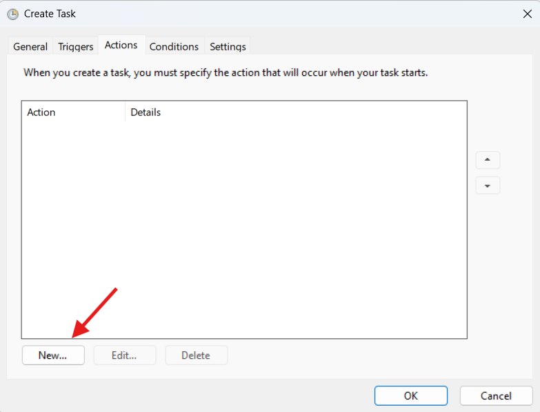
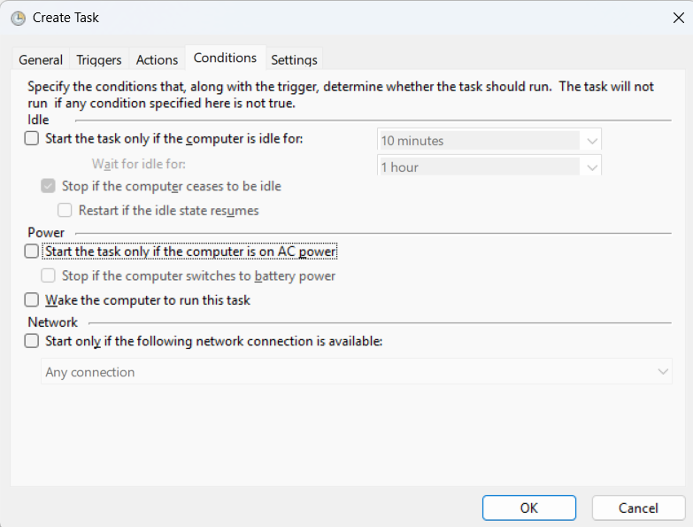
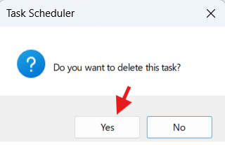

# Windows Task Scheduler Guide for Running pentaho job via Kitchen

## 1. Overview
Windows Task Scheduler automates the execution of programs, scripts, or commands at specific times or events. This guide covers how to:
- Schedule a pentaho job
- Modify the schedule
- Rerun tasks
- Check run history
- Manage tasks effectively

---

## 2. Creating a New Task

### Steps
1. **Open Task Scheduler**
   - Press `Win + R`
   - Type:
     ```text
     taskschd.msc
     ```
     and press **Enter**.


2. **Create a New Task**
   - In the right-hand **Actions** panel, click **Create Task** (not *Basic Task*).


3. **General Tab**
   - **Name**: Example: `Run My VBS Script`
   - **Description**: Optional but recommended
   - **Security Options**:
     - Select **Run whether user is logged on or not**
     - Check **Run with highest privileges** if admin rights are needed


4. **Triggers Tab** (When it runs)


   - Click **New…**
   - Choose:
     - Daily, Weekly, At startup, or On an event
   - Configure details → **OK**


5. **Actions Tab** (What it runs)



   - Click **New…**
   - **Action**: *Start a program*
   - **Program/script**:
     ```text
     pentaho_job_runner.vbs
     ```
   - **Add arguments (optional)**:
     ```text
     JOB NAME (eg. JOB_UMG)
     ```


6. **Conditions Tab**



   - Optional: Run only on AC power, require network, etc.

7. **Settings Tab**


   - Recommended:
     - **Allow task to be run on demand**
     - **If the task fails, restart every X minutes**
     - **If the running task does not end when requested, force it to stop** 

8. **Save**
   - Click **OK**
   - Enter your Windows account password if prompted


---

## 3. Modifying the Schedule


1. Open **Task Scheduler Library**
2. Right-click the task → **Properties**
3. Adjust:
   - **Triggers** (schedule)
   - **Actions** (script path or arguments)
4. **OK** to save

---

## 4. Running a Task Manually


1. Right-click the task → **Run**
2. **Status** changes to *Running*
3. To stop: Right-click → **End**

---

## 5. Checking Run History


1. Right-click the task → **Properties**
2. **History** tab  
   - If disabled: In right panel → **Enable All Tasks History**
3. View:
   - Start times
   - Success/failure
   - Error codes


---

## 6. Checking Last Run Status


- In **Task Scheduler Library**:
  - **Last Run Time** column → last execution timestamp
  - **Last Run Result** column:
    - `0x0` = Success
    - Others = Error (search online for meaning)

---

## 7. Exporting & Importing Tasks

* **Export**: Right-click → **Export** → saves `.xml`


* **Import**: **Import Task…** → select `.xml` file


---

## 8. Deleting a Task


* Right-click → **Delete** → Confirm


